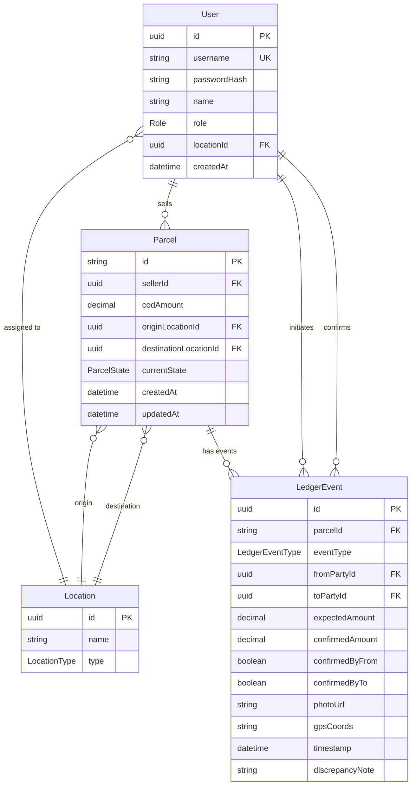

# Database Schema — FindMe

## Entity Relationship Diagram



---

## Enums

### `Role`
| Value | Description |
|---|---|
| `DELIVERY_AGENT` | Field agent collecting COD at doorstep |
| `BRANCH_STAFF` | Origin/destination branch employee |
| `HUB_OPERATOR` | Transit hub employee |
| `FINANCE_OFFICER` | Resolves discrepancies, approves payouts |
| `SELLER` | E-commerce seller receiving payouts |
| `ADMIN` | System administrator |

### `ParcelState` (State Machine)
```
CREATED
  └─► COD_COLLECTED          (by Delivery Agent)
        └─► HANDOVER_TO_DEST_HUB    (Branch → Dest Hub)
              └─► HANDOVER_TO_ORIGIN_HUB  (Dest Hub → Origin Hub)
                    └─► HANDOVER_TO_ORIGIN_BRANCH (Origin Hub → Branch)
                          ├─► SETTLED_TO_SELLER    (Branch → Seller ✅)
                          └─► DISCREPANCY_FLAGGED  (⚠ Amount mismatch)
                                └─► [Any state]   (After Finance resolves)
```

### `LedgerEventType`
Mirrors `ParcelState` — each state transition creates one `LedgerEvent`.

---

## Indexes

| Table | Index Field(s) | Purpose |
|---|---|---|
| `User` | `locationId` | Filter staff by branch/hub |
| `Parcel` | `currentState` | Dashboard state filters |
| `Parcel` | `createdAt` | Date-ordered queries |
| `Parcel` | `sellerId` | Seller dashboard queries |
| `LedgerEvent` | `parcelId` | Join parcel → events |
| `LedgerEvent` | `timestamp` | Chronological ordering |
| `LedgerEvent` | `toPartyId` | "My pending handovers" |
| `LedgerEvent` | `fromPartyId` | "Handovers I initiated" |

---

## Key Business Rules

1. A `LedgerEvent` is only "confirmed" when **both** `confirmedByFrom` and `confirmedByTo` are `true`.
2. If `expectedAmount ≠ confirmedAmount`, the parcel state is set to `DISCREPANCY_FLAGGED` and the event is frozen.
3. Only `FINANCE_OFFICER` or `ADMIN` can resolve a `DISCREPANCY_FLAGGED` parcel.
4. Once `SETTLED_TO_SELLER`, no further transitions are allowed.
5. Each `Parcel.codAmount` is set at creation and never changes — it is the source of truth for all comparisons.
